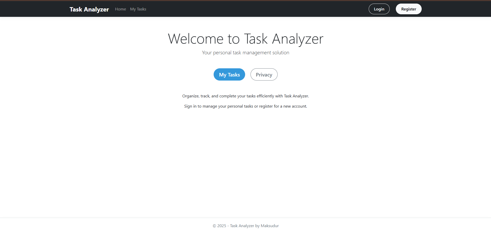
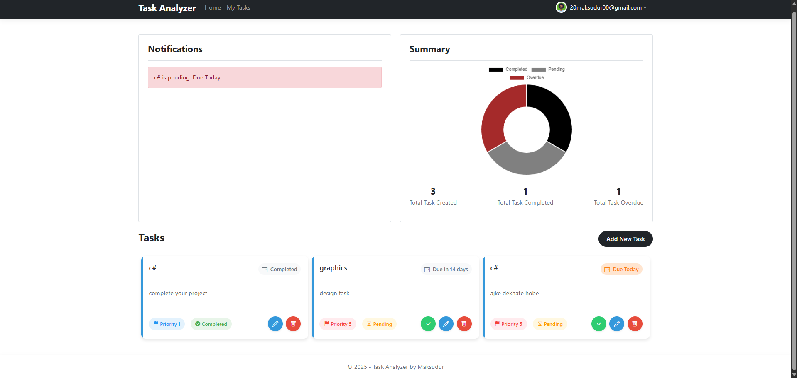
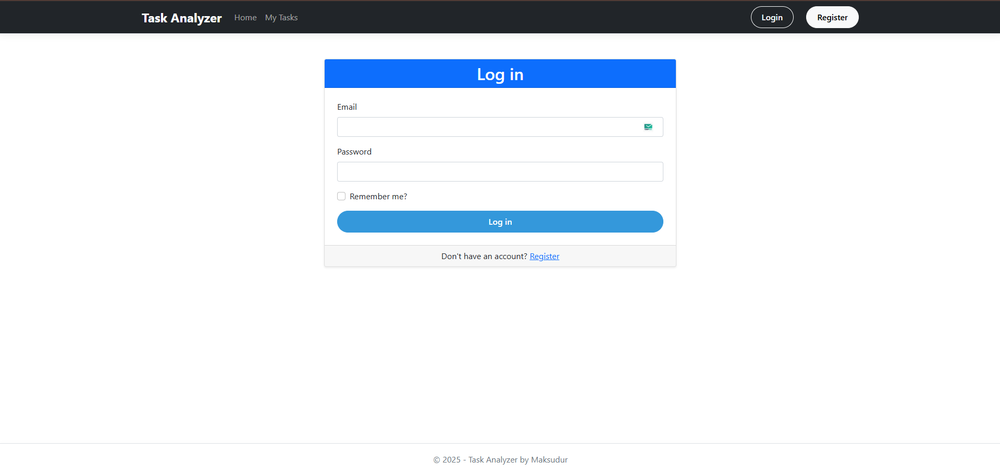
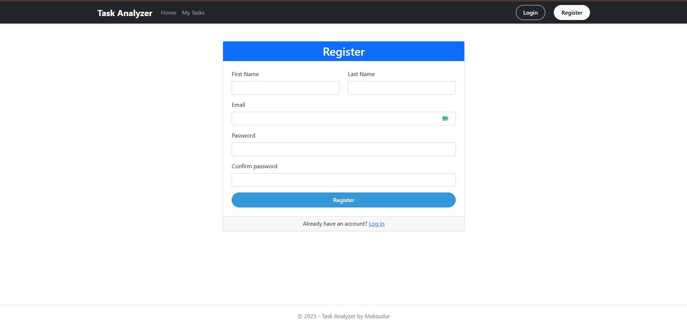
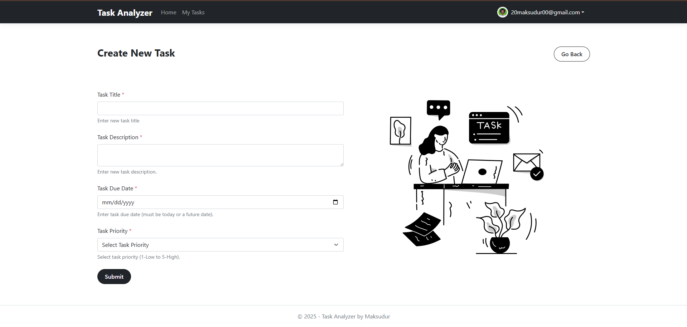
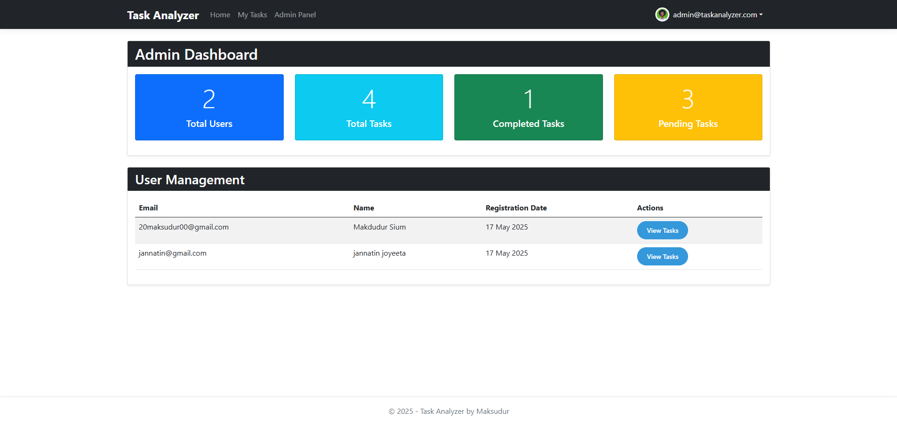
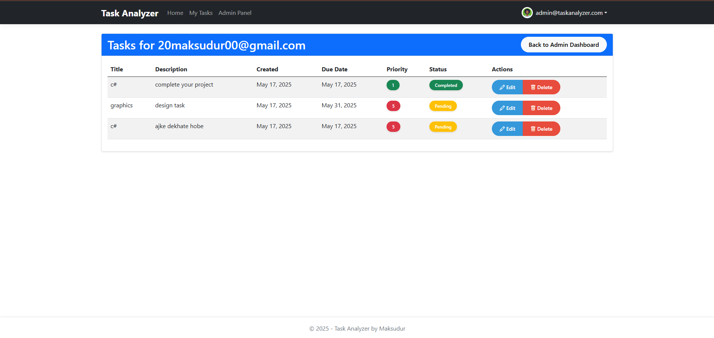
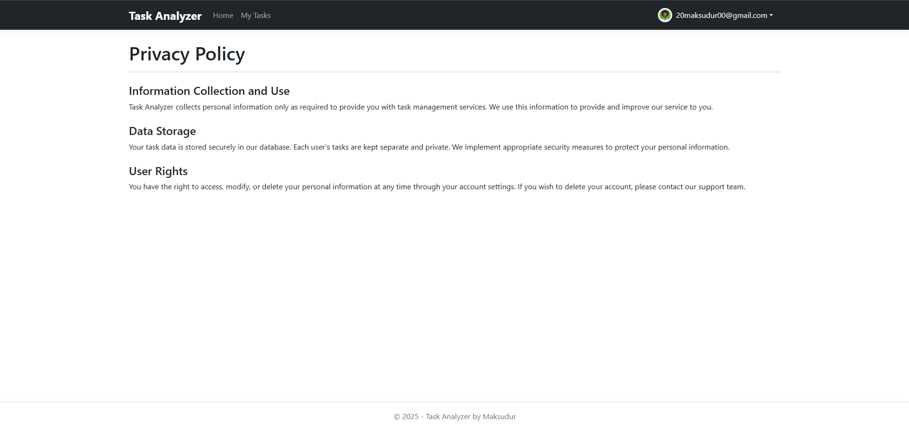

# Task Analyzer

Task Analyzer is a modern task management application built with ASP.NET Core MVC. It allows users to create, track, and manage their daily tasks with customizable priority levels and due dates. Authenticated users can create their own tasks, view their task history, and mark tasks as complete. The project features a clean, responsive UI, user authentication, role-based admin panel, and comprehensive task management capabilities.

---

## Features

- Create, edit, and manage personal tasks with customizable priorities (1-5)
- Set due dates for effective time management
- User registration, login, and profile management
- Authenticated users can create, edit, and delete their own tasks
- "My Tasks" section for users to view and manage their tasks
- Mark tasks as complete to track progress
- Admin panel for managing users and all tasks in the system
- Responsive Bootstrap UI for desktop and mobile devices

---

## Screenshots

### User Interface



### Authentication



### Task Management


### Administration



### Additional


---

## Project Structure

```
Task_Analyzer/
├── appsettings.Development.json
├── appsettings.json
├── LICENSE.txt
├── Task_Analyzer.csproj
├── Task_Analyzer.sln
├── Program.cs
├── README.md
├── TestConnection.cs
├── assets/
│   ├── adminpanel.png
│   ├── createtask.png
│   ├── edituserfromadminpanel.png
│   ├── home.png
│   ├── login.png
│   ├── privacypolicy.png
│   ├── register.png
│   └── taskanalyzer.png
├── Controllers/
│   ├── AccountController.cs
│   ├── AdminController.cs
│   ├── HomeController.cs
│   └── TaskController.cs
├── Data/
│   ├── ApplicationDbContext.cs
│   └── DesignTimeDbContextFactory.cs
├── Migrations/
│   ├── 20250516182359_InitialSetup.cs
│   ├── 20250516182359_InitialSetup.Designer.cs
│   ├── 20250516185830_AddRegistrationDateToUser.cs
│   ├── 20250516185830_AddRegistrationDateToUser.Designer.cs
│   └── ApplicationDbContextModelSnapshot.cs
├── Models/
│   ├── ApplicationUser.cs
│   ├── ErrorViewModel.cs
│   └── TodoTask.cs
├── Properties/
│   └── launchSettings.json
├── Services/
│   └── DbInitializer.cs
├── ViewModels/
│   ├── LoginViewModel.cs
│   └── RegisterViewModel.cs
├── Views/
│   ├── Account/
│   │   ├── Lockout.cshtml
│   │   ├── Login.cshtml
│   │   └── Register.cshtml
│   ├── Admin/
│   │   ├── DeleteTask.cshtml
│   │   ├── EditTask.cshtml
│   │   ├── Index.cshtml
│   │   └── UserTasks.cshtml
│   ├── Home/
│   │   ├── Index.cshtml
│   │   └── Privacy.cshtml
│   ├── Shared/
│   │   ├── Error.cshtml
│   │   ├── _Layout.cshtml
│   │   ├── _Layout.cshtml.css
│   │   └── _ValidationScriptsPartial.cshtml
│   ├── Task/
│   │   ├── Create.cshtml
│   │   ├── Delete.cshtml
│   │   ├── Details.cshtml
│   │   ├── Edit.cshtml
│   │   └── Index.cshtml
│   ├── _ViewImports.cshtml
│   └── _ViewStart.cshtml
└── wwwroot/
    ├── css/
    ├── images/
    ├── js/
    ├── lib/
    └── favicon.ico
```

---

## Getting Started

### Prerequisites

- [.NET 8.0 SDK](https://dotnet.microsoft.com/en-us/download/dotnet/8.0)
- SQL Server (or change connection string for your DB)

### Installation

1. **Clone the repository:**

   ```bash
   git clone https://github.com/Maksudur20/Task_Analyzer.git
   cd Task_Analyzer
   ```

2. **Restore NuGet packages:**

   ```bash
   dotnet restore
   ```

3. **Apply database migrations:**

   ```bash
   dotnet ef database update
   ```

4. **Run the application:**

   ```bash
   dotnet run
   ```

5. **Open in browser:**

   Visit `https://localhost:5001` or `http://localhost:5053`

6. **Admin Credential:**

   ```text
   Email: admin@taskanalyzer.com
   Pass: Admin@123
   ```

---

## Usage

- Register a new account or log in with your credentials
- Create new tasks with a title, description, priority level, and due date
- View your tasks and filter by completion status
- Edit existing tasks or mark them as complete
- Delete tasks you no longer need
- Admins can access the admin panel to manage all users' tasks

---

## Contributing

Pull requests are welcome! For major changes, please open an issue first to discuss what you would like to change.

---

## License

This project is licensed under the MIT License.

---

## Contact

For questions or support, open an issue or contact the maintainer at [20maksudur00@gmail.com](mailto:20maksudur00@gmail.com).

---

## Credits

- Built with ASP.NET Core MVC
- UI powered by Bootstrap